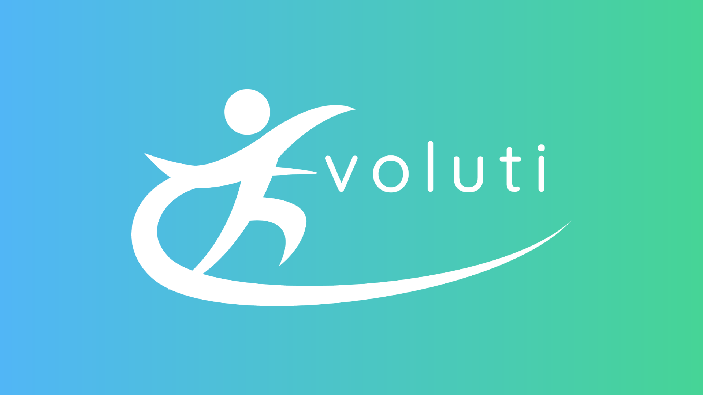

# Evoluti

> O Evoluti é um projeto de solução software Web para gestão na evolução de tratamentos fisioterapeuticos, trazendo o conceito inovador de cuidar de clínicas de fisioterapia facilitando a organização dos dados de pacientes com registros detalhados, trazendo o conceito paperless em sua base.

### 🛠️ Ajustes e melhorias

O projeto ainda está em desenvolvimento e as próximas atualizações serão voltadas nas seguintes tarefas:

- [x] Web Page
- [x] Área de Login/Cadastros
- [ ] Mantimento de Usuários
- [ ] Mantimento de Pacientes
- [ ] Filtros
- [ ] Atendimento
- [ ] Prontuário Eletrônico
- [ ] Documentação
- [ ] Testes

## ⚙️ Tecnologias Utilizadas
  

    
     &nbsp;&nbsp;
    
    &nbsp;&nbsp;
     
     
    &nbsp;&nbsp;
    
    &nbsp;&nbsp;
    
    &nbsp;&nbsp;
    
    &nbsp;&nbsp;
    
     
     
    
    &nbsp;&nbsp;
    
    &nbsp;&nbsp;
    
    &nbsp;&nbsp;
  

## 💻 Pré-requisitos

Antes de começar, verifique se você atendeu aos seguintes requisitos:

- Você tem uma máquina `<Windows / Linux / Mac>`
- Você tem algum navegador, como `<Google Chrome / Opera / Mozilla Firefox / Microsoft Edge>`
- Você leu `< / >`.

## 📫 Contribuindo com o Evoluti

Para contribuir com Evoluti, siga estas etapas:

1. Bifurque este repositório.
2. Crie um branch: `git checkout -b <nome_branch>`.
3. Faça suas alterações e confirme-as: `git commit -m '<mensagem_commit>'`
4. Envie para o branch original: `git push origin Evoluti-React / <local>`
5. Crie a solicitação de pull.

Como alternativa, consulte a documentação do GitHub em [como criar uma solicitação pull](https://help.github.com/en/github/collaborating-with-issues-and-pull-requests/creating-a-pull-request).

## 🤝 Nossa Equipe

Apresentamos nossa equipe, na qual contribuiu para este projeto:

<table>
  <tr>
  <td align="center">
      <a href="https://github.com/brunocmartins11" title="Bruno Martins">
         
        
          <b>Bruno Martins</b>
        
      </a>
    </td>
    <td align="center">
      <a href="https://github.com/Poliester2005" title="Eduardo Pielich">
         
        
          <b>Eduardo Pielich</b>
        
      </a>
    </td>
    <td align="center">
      <a href="https://github.com/haku1112" title="Juliana Alves">
         
        
          <b>Juliana Alves</b>
        
      </a>
    </td>
    <td align="center">
      <a href="https://github.com/RenatoAC2004" title="Renato Carvalho">
         
        
          <b>Renato Carvalho</b>
        
      </a>
    </td>
  </tr>
</table>